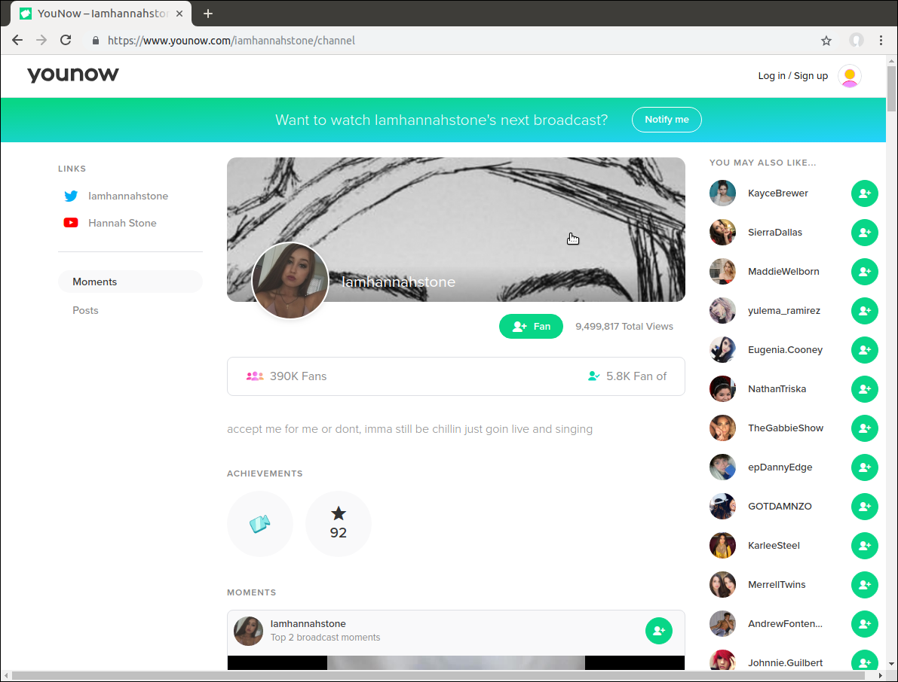
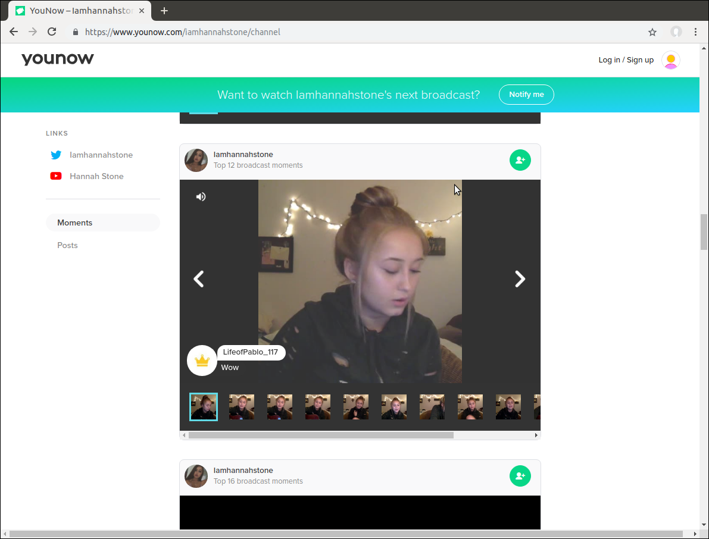
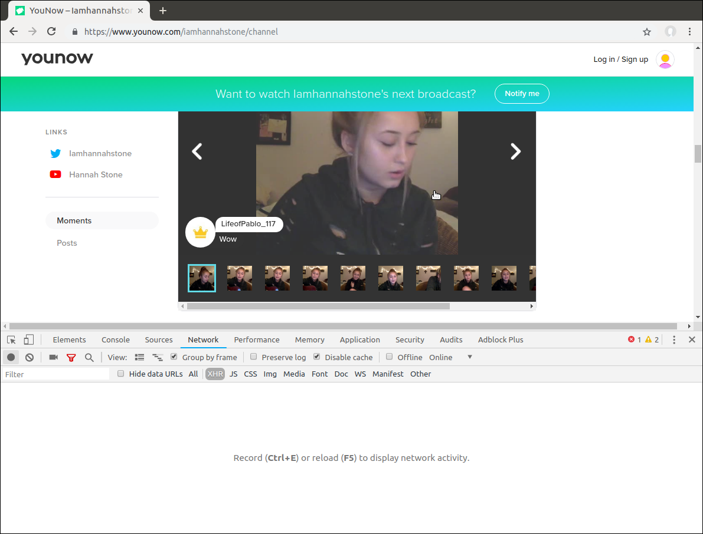
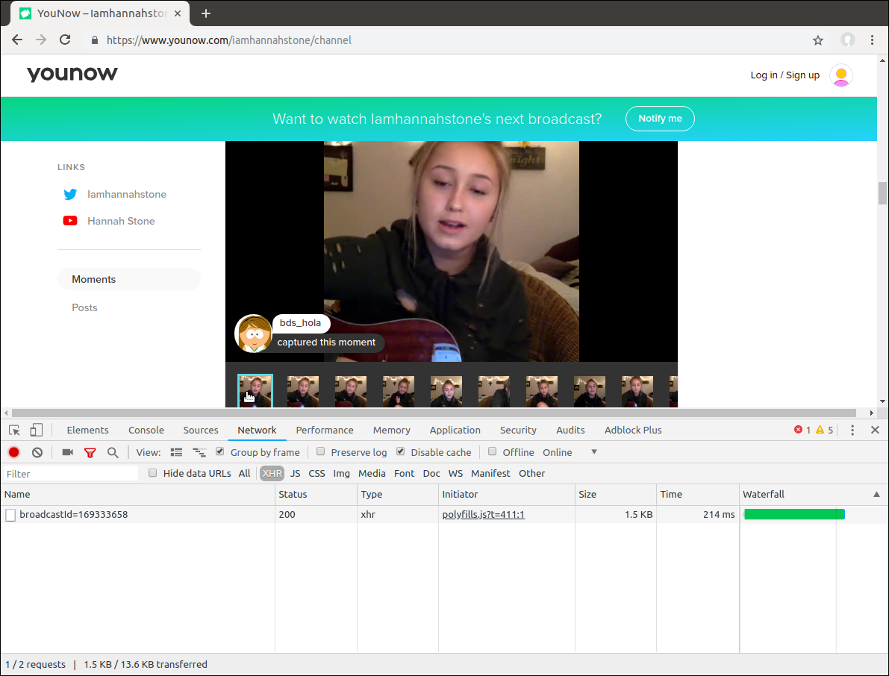
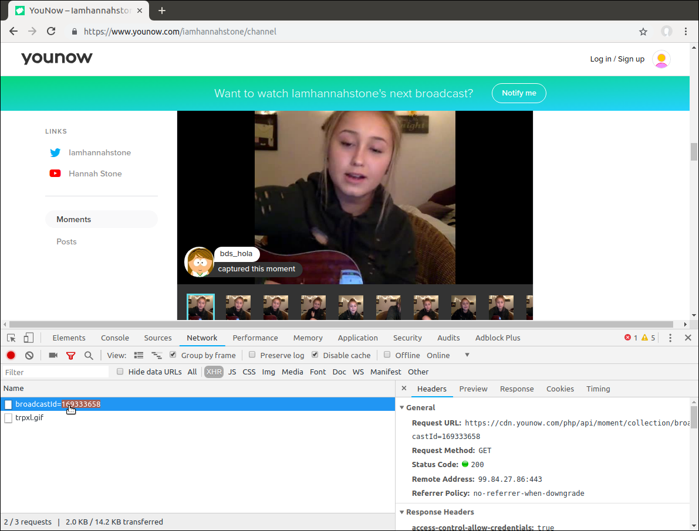

# YouNow Download Moments

Just because [you can't download moments from YouNow](https://younow.zendesk.com/hc/en-us/articles/208995546-Can-I-download-moments), now you can! _(kinda)_.

## Usage

Requisites:
- [FFmpeg](https://www.ffmpeg.org)
- [Node.js](https://nodejs.org) v8+

```bash
## Clone this repo
git clone https://github.com/micalevisk/younow-download.git

cd younow-download

## Install the dependencies using Node Package Manager
npm install
```

### Download moments using [unix timestamp](https://www.unixtimestamp.com/) reference

```bash
node app <CREATED_BEFORE> <RECORDS> <CHANNEL> <PATH/TO/OUTPUT/DIRECTORY/>
#               |              |                          |
#               |              |                          +--> where the files will be stored
#               |              +--> number of records to fecth (max:19)
#               +--> unix timestamp

## EXAMPLE: download the last 2 moments
node app 0 2 iamhannahstone __videos__
```

### Download all captured broadcast moments

```bash
node app <BROADCAST_ID> <PATH/TO/OUTPUT/DIRECTORY/>
#             |                   |
#             |                   +--> where the files will be stored
#             +--> read below to see how to get this number from younow.com

## EXAMPLE:
node app 169333658 __videos__
```

### How to find `BROADCAST_ID`

<details>

Example using Google Chrome browser.

#### 1. Go to user's channel
like: https://www.younow.com/iamhannahstone/channel

[]()

#### 2. Scroll down to find the moment you wanna download

[]()

#### 3. Open dev tools (<kbd>CTRL+SHIFT+I</kbd>) and got to `Network` tab

[]()

#### 4. Click over some thumbnail and look at dev tools

[]()

#### 5. Done! Copy the value after `broadcastId=`

[]()

</details>
